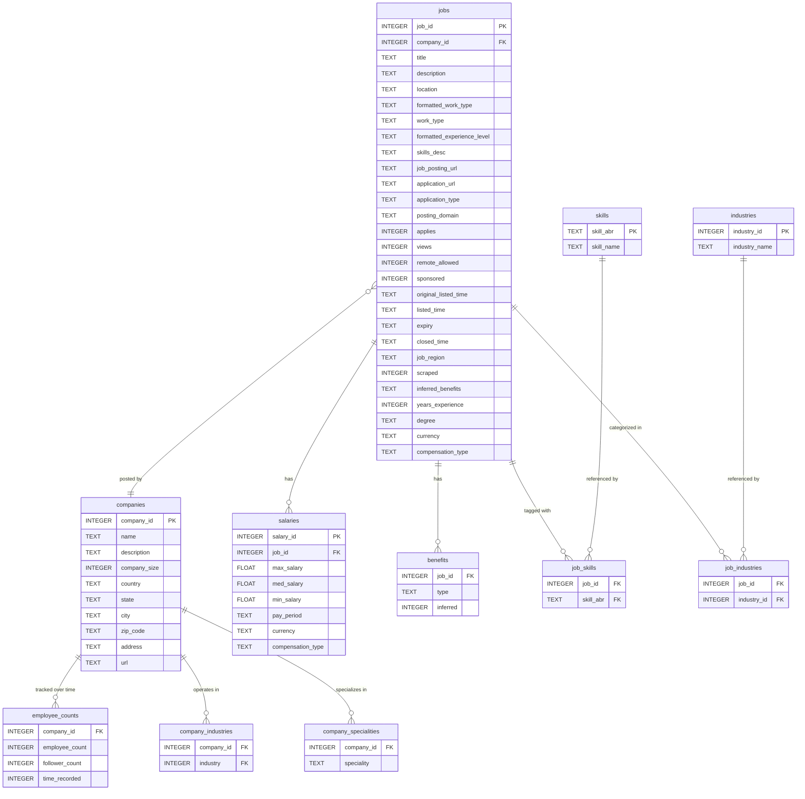

# Database Schema

The scraper stores all data in a SQLite file: `linkedin_jobs.db`.

## Entity Relationship Diagram

## Table Reference

### `jobs`
The central table. Rows are inserted by `search_retriever.py` with `scraped=0` and updated to `scraped=<unix_timestamp>` by `details_retriever.py`.

| Column | Type | Notes |
|---|---|---|
| `job_id` | INTEGER PK | LinkedIn's internal job ID |
| `company_id` | INTEGER FK | References `companies` |
| `title` | TEXT | Job title (populated by search phase) |
| `description` | TEXT | Full job description (details phase) |
| `location` | TEXT | Formatted location string |
| `formatted_work_type` | TEXT | Full-time, Part-time, Contract |
| `work_type` | TEXT | Raw LinkedIn employment status code |
| `formatted_experience_level` | TEXT | Entry, Associate, Mid-Senior, Director, Executive |
| `skills_desc` | TEXT | Free-text skills description from posting |
| `applies` | INTEGER | Application count |
| `views` | INTEGER | View count |
| `remote_allowed` | INTEGER | 1 if remote permitted |
| `sponsored` | INTEGER | 1 if promoted listing |
| `scraped` | INTEGER | 0 = not yet scraped; unix timestamp = scraped at; -1 = error |
| `original_listed_time` | TEXT | Original listing timestamp |
| `listed_time` | TEXT | Current listing timestamp |
| `expiry` | TEXT | Expiry timestamp |
| `closed_time` | TEXT | Closed timestamp |

### `salaries`
Multiple salary records can exist per job (different compensation types).

| Column | Type | Notes |
|---|---|---|
| `salary_id` | INTEGER PK | Auto-assigned |
| `job_id` | INTEGER FK | References `jobs` |
| `max_salary` | FLOAT | |
| `med_salary` | FLOAT | |
| `min_salary` | FLOAT | |
| `pay_period` | TEXT | HOURLY, MONTHLY, YEARLY |
| `currency` | TEXT | ISO currency code |
| `compensation_type` | TEXT | BASE_SALARY, BONUS, etc. |

### `benefits`
Each row is one benefit type for a job.

| Column | Notes |
|---|---|
| `job_id` | References `jobs` |
| `type` | e.g. "401K", "Medical Insurance", "Vision Insurance" |
| `inferred` | 0 = explicitly listed by company; 1 = inferred by LinkedIn from job text |

### `companies`

| Column | Notes |
|---|---|
| `company_id` | LinkedIn's internal company ID |
| `company_size` | Integer 0–7 encoding headcount ranges (see below) |
| `url` | LinkedIn company page URL |

**`company_size` encoding:**

| Value | Range |
|---|---|
| 0 | 1–10 |
| 1 | 11–50 |
| 2 | 51–200 |
| 3 | 201–500 |
| 4 | 501–1000 |
| 5 | 1001–5000 |
| 6 | 5001–10000 |
| 7 | 10001+ |

### `employee_counts`
Tracks headcount over time; a new row is inserted each scrape cycle.

### `skills` / `job_skills`
`skills` is a lookup table keyed by abbreviation. `job_skills` is the many-to-many join (job ↔ skill).

> **Note:** Skills here come from LinkedIn's `jobFunctions` field, not the free-text `skills_desc` field in `jobs`.

### `industries` / `job_industries`
Same pattern as skills — lookup table + join table.

### `company_industries` / `company_specialities`
Company-level industry and speciality tags stored as raw LinkedIn IDs/strings.

## `scraped` Field State Machine

