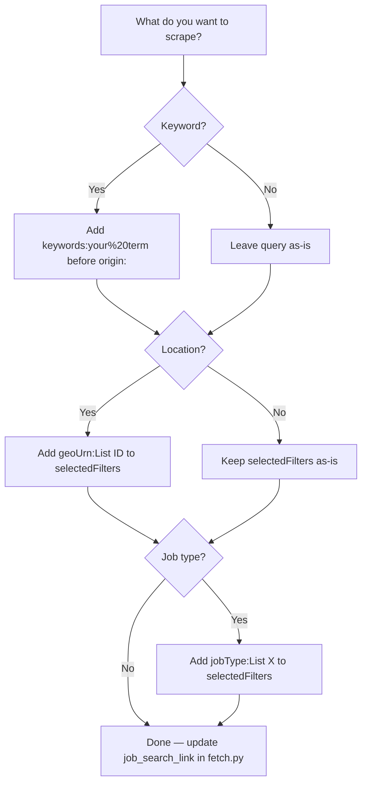

# Keyword & Filter Targeting

By default, `search_retriever.py` scrapes LinkedIn's default job feed with no keyword filter — it returns whatever LinkedIn's algorithm surfaces. This document explains how to target specific keywords, locations, and other filters.

## How the Search URL Works

The search endpoint in `scripts/fetch.py` (`JobSearchRetriever.__init__`) uses LinkedIn's Voyager API:

```
https://www.linkedin.com/voyager/api/voyagerJobsDashJobCards
  ?decorationId=com.linkedin.voyager.dash.deco.jobs.search.JobSearchCardsCollection-187
  &count=100
  &q=jobSearch
  &query=(origin:JOB_SEARCH_PAGE_OTHER_ENTRY,selectedFilters:(sortBy:List(DD)),spellCorrectionEnabled:true)
  &start=0
```

The `query=` parameter is a LinkedIn-specific encoding. Filters are added inside the `query=(...)` block.

## Adding a Keyword Filter

Edit `scripts/fetch.py`, `JobSearchRetriever.__init__`, and add `keywords:YOUR_KEYWORD` to the `query=` value:

**Before:**
```python
self.job_search_link = (
    'https://www.linkedin.com/voyager/api/voyagerJobsDashJobCards'
    '?decorationId=com.linkedin.voyager.dash.deco.jobs.search.JobSearchCardsCollection-187'
    '&count=100&q=jobSearch'
    '&query=(origin:JOB_SEARCH_PAGE_OTHER_ENTRY,'
    'selectedFilters:(sortBy:List(DD)),spellCorrectionEnabled:true)'
    '&start=0'
)
```

**After (example: "data engineer"):**
```python
self.job_search_link = (
    'https://www.linkedin.com/voyager/api/voyagerJobsDashJobCards'
    '?decorationId=com.linkedin.voyager.dash.deco.jobs.search.JobSearchCardsCollection-187'
    '&count=100&q=jobSearch'
    '&query=(keywords:data%20engineer,'
    'origin:JOB_SEARCH_PAGE_OTHER_ENTRY,'
    'selectedFilters:(sortBy:List(DD)),spellCorrectionEnabled:true)'
    '&start=0'
)
```

Use `%20` for spaces in multi-word keywords.

## Common Keyword Examples

| Target | `keywords:` value |
|---|---|
| Python developer | `keywords:python%20developer` |
| Data engineer | `keywords:data%20engineer` |
| Machine learning | `keywords:machine%20learning` |
| Software engineer | `keywords:software%20engineer` |
| Product manager | `keywords:product%20manager` |

## Adding a Location Filter

Location filters use LinkedIn's internal `geoUrn` IDs in `selectedFilters`:

```
selectedFilters:(geoUrn:List(XXXXXX),sortBy:List(DD))
```

**Common `geoUrn` values:**

| Location | geoUrn |
|---|---|
| United States | `103644278` |
| United Kingdom | `101165590` |
| Canada | `101174742` |
| Germany | `101282230` |
| Remote (worldwide) | `90000084` |

**Example — "data engineer" in the United States:**
```python
'&query=(keywords:data%20engineer,'
'origin:JOB_SEARCH_PAGE_OTHER_ENTRY,'
'selectedFilters:(geoUrn:List(103644278),sortBy:List(DD)),'
'spellCorrectionEnabled:true)'
```

## Adding a Job Type Filter

Add `jobType` to `selectedFilters`:

| Job Type | Filter value |
|---|---|
| Full-time | `jobType:List(F)` |
| Part-time | `jobType:List(P)` |
| Contract | `jobType:List(C)` |
| Internship | `jobType:List(I)` |
| Remote | `jobType:List(R)` |

**Example — full-time + keyword + location:**
```python
'selectedFilters:(geoUrn:List(103644278),jobType:List(F),sortBy:List(DD))'
```

## Combining Multiple Filters

Filters inside `selectedFilters:(...)` are comma-separated:

```
selectedFilters:(
  geoUrn:List(103644278),
  jobType:List(F),
  sortBy:List(DD)
)
```

## Filter Decision Flow



## Finding GeoUrn IDs for Other Locations

1. Go to `https://www.linkedin.com/jobs/search/` in your browser
2. Apply a location filter
3. Open browser DevTools → Network tab
4. Look for a request to `voyagerJobsDashJobCards`
5. Copy the `geoUrn` value from the query parameters
