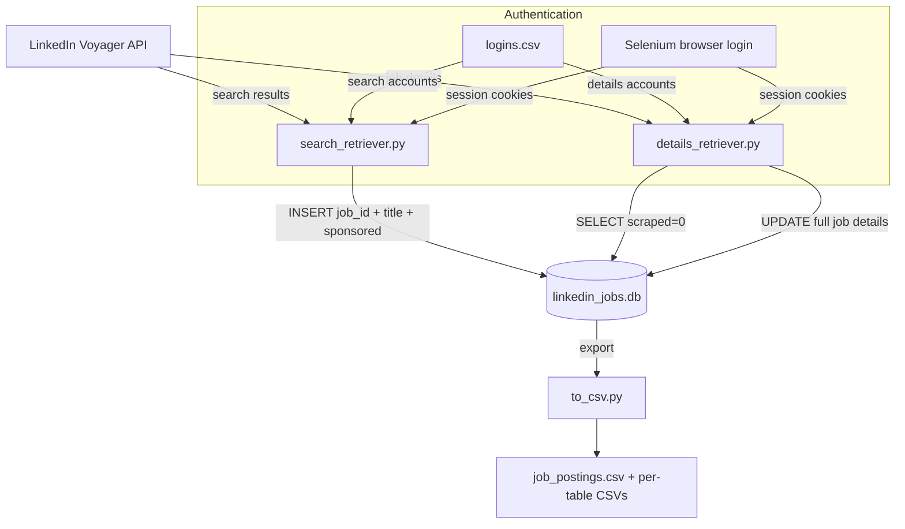
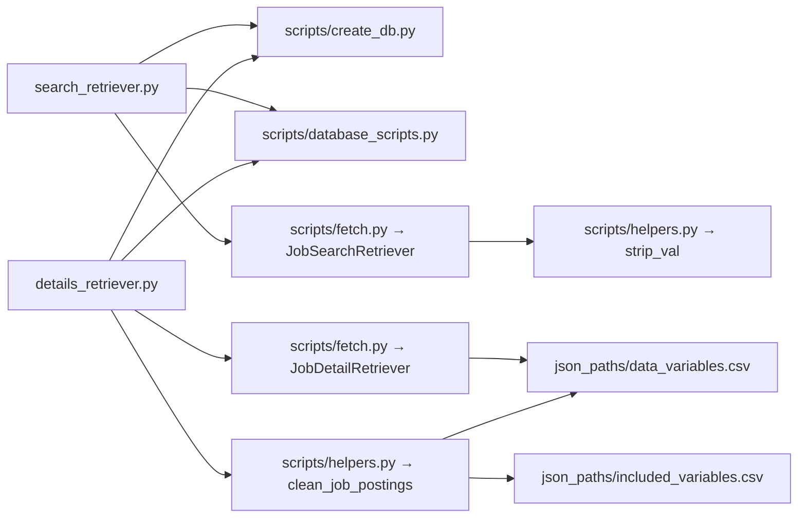
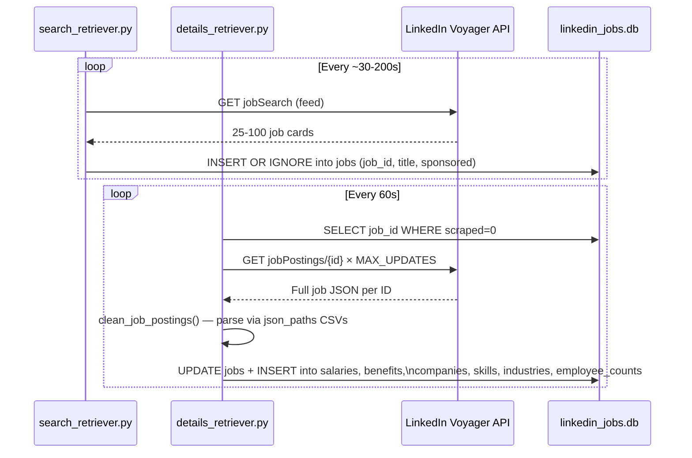

# Architecture Overview

This tool scrapes LinkedIn job postings using LinkedIn's internal Voyager API (not the public API). It is split into two independent processes that run in parallel and share a SQLite database.

## High-Level Architecture

## Process Responsibilities

| Process | Script | Role |
|---|---|---|
| Search Retriever | `search_retriever.py` | Polls LinkedIn search feed. Extracts job IDs + title + sponsored status. Writes stub rows to `jobs` table. |
| Details Retriever | `details_retriever.py` | Reads unscraped job IDs from DB. Fetches full job data per-ID. Populates all tables. |
| CSV Exporter | `to_csv.py` | Dumps all DB tables to CSV files. Produces a merged `job_postings.csv`. |

## Module Map

## Data Flow

## Key Design Decisions

- **No official API** — Uses the same internal `voyager/api` endpoints the LinkedIn web app uses, authenticated via browser session cookies captured through Selenium.
- **Cookie-based auth** — Selenium logs in once per account, captures cookies into a `requests.Session`, then the browser is closed. All subsequent calls are headless HTTP.
- **Two-speed pipeline** — Search is cheap (one call = ~100 jobs). Detail fetching is expensive (one call per job). Separate accounts + rate limiting keep both from getting blocked.
- **Adaptive sleep** — `search_retriever.py` adjusts its sleep time based on how many new results it's finding, slowing down when the feed is saturated.
- **JSON path mapping** — `json_paths/data_variables.csv` and `included_variables.csv` are configuration files that map LinkedIn's API response JSON paths to DB column names — no hardcoded parsing logic per field.
