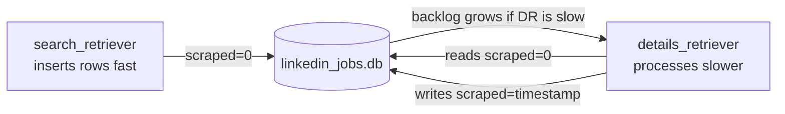

# Running & Operations

## Starting the Scraper

Run both scripts in parallel in separate terminals:

```bash
# Terminal 1 — discovers new job IDs
python search_retriever.py

# Terminal 2 — fetches full job details
python details_retriever.py
```

Both scripts connect to (or create) `linkedin_jobs.db` in the current directory.

## First-Run Login

Each script opens a browser window for every account in `logins.csv` (filtered by `method`). For each account:

1. The browser navigates to LinkedIn sign-in
2. Credentials are entered automatically
3. **You must press ENTER in the terminal** after the login succeeds
4. This handles CAPTCHA, 2FA, and "verify it's you" prompts manually
5. Cookies are saved into a `requests.Session`; the browser closes

This only happens once per run. If the script restarts, it logs in again.

## Normal Operation Output

**`search_retriever.py`:**
```
5/47 NEW RESULTS | 3/42 NEW NON-PROMOTED RESULTS
Sleeping For 84.3 Seconds...
Resuming...
```

**`details_retriever.py`:**
```
Job 3912847561 done
Job 3912847562 done
...
UPDATED 25 VALUES IN DB
Sleeping For 60 Seconds...
Resuming...
```

## Monitoring Scrape Progress

Query the database directly to check status:

```bash
sqlite3 linkedin_jobs.db "SELECT
  COUNT(*) AS total,
  SUM(CASE WHEN scraped = 0 THEN 1 ELSE 0 END) AS pending,
  SUM(CASE WHEN scraped > 0 THEN 1 ELSE 0 END) AS done,
  SUM(CASE WHEN scraped = -1 THEN 1 ELSE 0 END) AS errors
FROM jobs;"
```

## Exporting to CSV

```bash
python to_csv.py --folder ./output --database linkedin_jobs.db
```

This creates:
- One `.csv` file per table (e.g. `companies.csv`, `benefits.csv`, `skills.csv`, etc.)
- A merged `job_postings.csv` that joins `jobs` + `salaries` (only rows with `scraped > 0`)
- Removes the raw `jobs.csv` after creating the merged file

Output columns in `job_postings.csv`:
```
job_id, company_id, title, description, max_salary, med_salary, min_salary, pay_period,
formatted_work_type, location, applies, original_listed_time, remote_allowed, views,
job_posting_url, application_url, application_type, expiry, closed_time,
formatted_experience_level, skills_desc, listed_time, posting_domain, sponsored,
work_type, currency, compensation_type, scraped
```

## Handling Errors & Rate Limiting

### `details_retriever.py` stops after 10 consecutive errors
This usually means the account/IP is rate-limited. Strategies:
- Reduce `MAX_UPDATES` 
- Increase `SLEEP_TIME`
- Add more `details` accounts to `logins.csv`
- Run during off-peak hours (late night, weekends)
- Add proxies (see [setup.md](setup.md))

### Non-200 status codes
Jobs that return errors are marked `scraped = -1` and skipped in future polls. They are never retried automatically.

### Account sessions expire
Sessions use browser cookies that expire. If you start getting 401/403 errors consistently, restart the script to re-authenticate.

## Sync Between Processes



`search_retriever.py` typically outruns `details_retriever.py`. The backlog of `scraped=0` rows will grow over time — this is expected. Run `details_retriever.py` for longer uninterrupted periods (e.g. overnight) to catch up.
