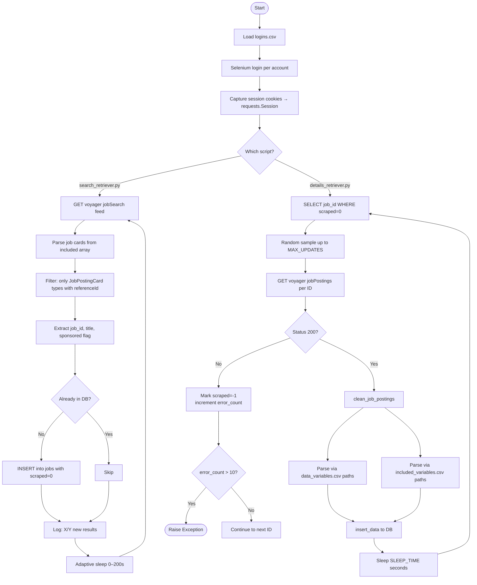
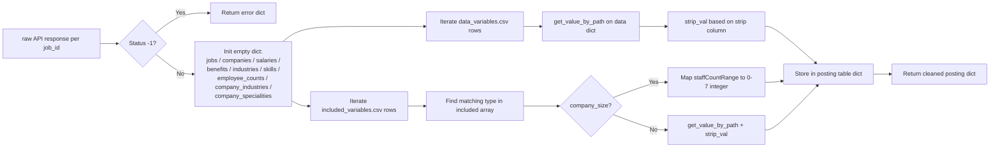

# Scraping Pipeline

## Pipeline Overview



## Search Retriever Detail

`search_retriever.py` calls a single LinkedIn Voyager endpoint that returns a paginated job search feed. Key behaviors:

- Calls `voyagerJobsDashJobCards` with `count=100` and `sortBy:DD` (date descending)
- Iterates through `results['included']` looking for `$type == JobPostingCard` entries with a `referenceId`
- Extracts `jobPostingUrn` (splits on `:` to get the numeric ID) and checks for `PROMOTED` footer items
- **No keyword filter by default** — see [keyword-targeting.md](keyword-targeting.md) to add one
- Session is rotated round-robin across all `search` accounts

**Adaptive sleep logic:**
```
seconds_per_job = sleep_factor / max(new_results, 1)
sleep_factor    = min(seconds_per_job × total_non_sponsored × 0.75, 200)
```
This means sleep shrinks when many new jobs are found and grows when the feed is saturated.

## Details Retriever Detail

`details_retriever.py` fetches one job per HTTP request from `voyager/api/jobs/jobPostings/{job_id}`.

- Randomly samples up to `MAX_UPDATES` unscraped jobs per cycle to avoid predictable patterns
- 300ms delay between each individual job request
- Rotates through all `details` accounts round-robin
- Raises a fatal exception after 10 consecutive errors (likely IP/account ban)

## JSON Path Parsing

Field extraction is data-driven — no hardcoded per-field parsing. Two CSV config files define which JSON paths map to which DB columns:

### `json_paths/data_variables.csv`
Paths into the top-level `data` key of the job detail response.

| Column | Meaning |
|---|---|
| `path` | Python dict-access path string, e.g. `['data']['title']` |
| `name` | Target DB column name |
| `strip` | Post-processing: `0`=raw, `1`=split on `:` take last, `2`=split on `.` take last |
| `table` | Target DB table |

### `json_paths/included_variables.csv`
Paths into objects in the `included` array (used for company data, follower counts, etc.).

| Column | Meaning |
|---|---|
| `path` | Dict path within each `included` item |
| `name` | Target DB column name |
| `type` | Filters `included` items by their `$type` suffix (e.g. `Company`, `FollowingInfo`) |
| `table` | Target DB table |

## `clean_job_postings()` Logic



## Database Write Logic

`insert_data()` in `scripts/database_scripts.py` handles each table differently:

| Table | Write Strategy |
|---|---|
| `jobs` | `UPDATE` (row already exists from search phase) |
| `benefits` | `INSERT OR REPLACE` for listed; `INSERT OR IGNORE` for inferred |
| `industries` | `INSERT OR REPLACE` with `COALESCE` to preserve existing name |
| `skills` | Same as industries |
| `salaries` | `INSERT` (allows multiple per job) |
| `companies` | `INSERT OR REPLACE` |
| `employee_counts` | `INSERT OR IGNORE` (preserves historical snapshots) |
| `company_industries` | `INSERT OR IGNORE` |
| `company_specialities` | `INSERT OR IGNORE` |
